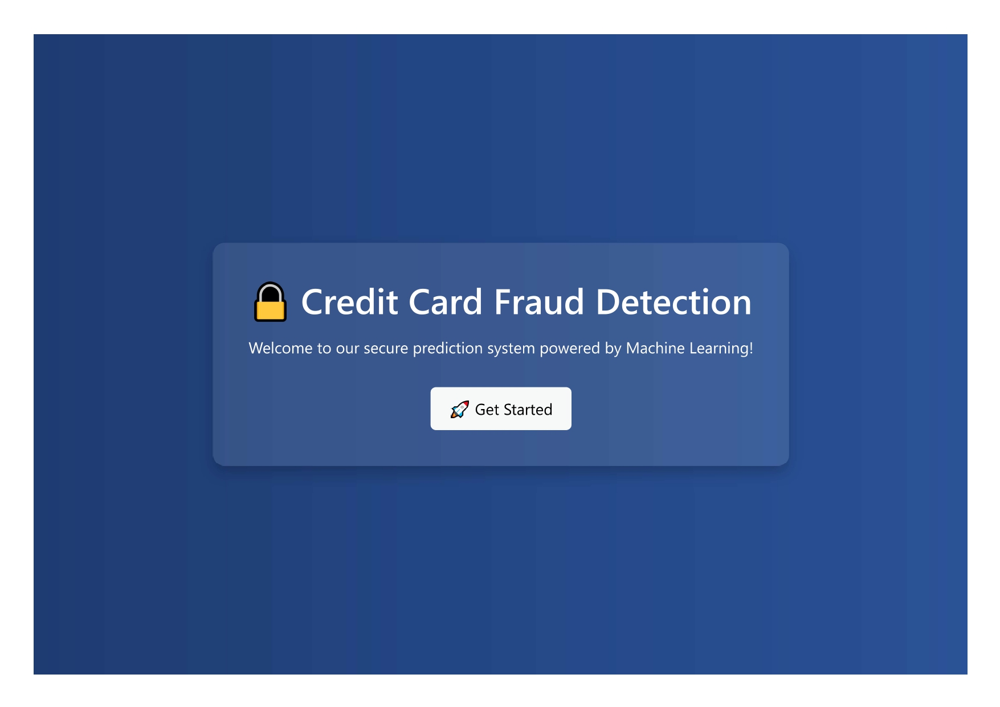
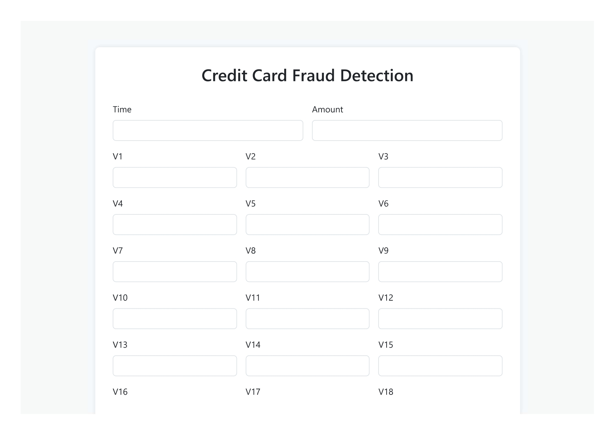
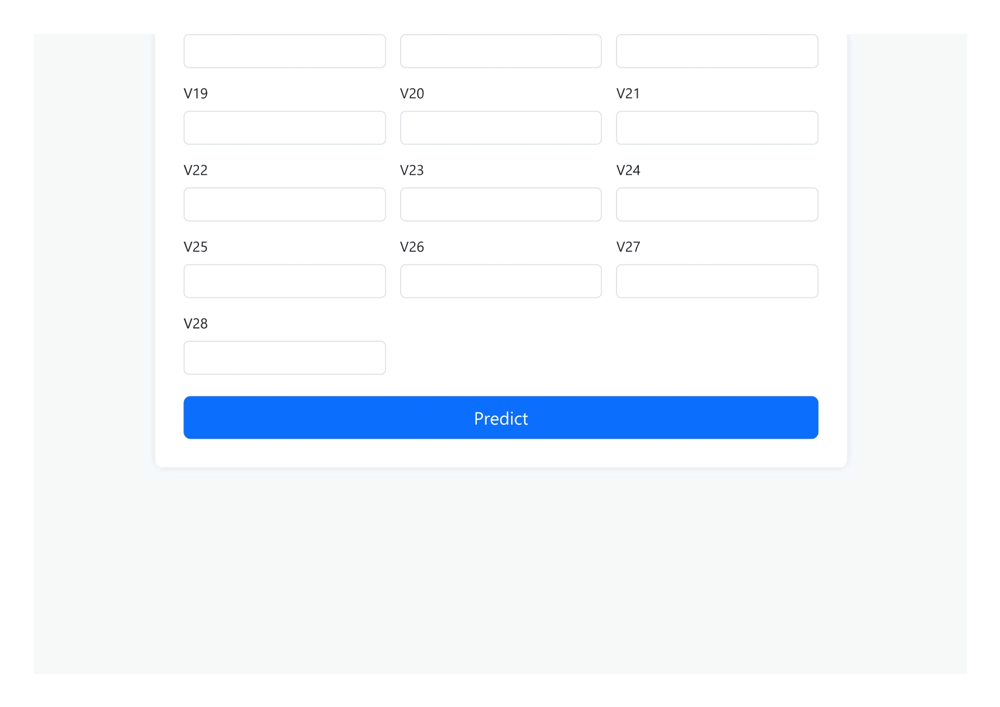

# 🛡️ Credit Card Fraud Detection using ML and Flask

This is a full-stack machine learning application that detects fraudulent credit card transactions using a trained Random Forest model, built with Scikit-learn and deployed via Flask. The project uses SMOTE for handling class imbalance, and a user-friendly web UI for predictions.

---

© 2025 Vishal Benake. All rights reserved.  
Unauthorized copying, distribution, or modification of this code is prohibited.

---

## 🚀 Demo

Here are some screenshots of the live application:

### 🖼️ UI Demo

<p align="center">
  
  
  
</p>

---

## 🛠️ How to Use

Follow these steps to set up and run the application:

1. **Clone the repository**  
   ```bash
   git clone https://github.com/vishal-benake/Credit-Card-Fraud-Detection-using-ML-and-Flask.git
   cd Credit-Card-Fraud-Detection-using-ML-and-Flask
   ```

2. **Create and activate virtual environment**  
   ```bash
   python -m venv venv
   # On Windows
   venv\Scripts\activate
   # On Mac/Linux
   source venv/bin/activate
   ```

3. **Install dependencies**  
   ```bash
   pip install -r requirements.txt
   ```

4. **Run the application**  
   ```bash
   python app.py
   ```

5. Open your browser and navigate to `http://127.0.0.1:5000`

---

## 📌 Requirements

- Python ≥ 3.7  
- Flask  
- scikit-learn  
- pandas  
- imbalanced-learn  
- joblib  
- chart.js (for frontend charts)

Install all with:
```bash
pip install -r requirements.txt
```

---

##  Youtube  
<h4>If you like, do follow me on Youtube</h4>  
<a href="https://www.youtube.com/@Code-With-Vishal">Connect with me on Youtube</a>

##  Instagram  
<h4>If you like, do follow me on Instagram</h4>  
<a href="https://www.instagram.com/vishaal_87">Connect with me on Instagram</a>

---

© 2025 Vishal Benake. All rights reserved.  
Unauthorized copying, distribution, or modification of this code is prohibited.